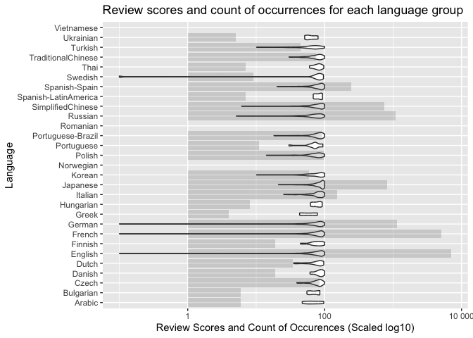

Mini Data Analysis Milestone 2
================

*To complete this milestone, you can either edit [this `.rmd`
file](https://raw.githubusercontent.com/UBC-STAT/stat545.stat.ubc.ca/master/content/mini-project/mini-project-2.Rmd)
directly. Fill in the sections that are commented out with
`<!--- start your work here--->`. When you are done, make sure to knit
to an `.md` file by changing the output in the YAML header to
`github_document`, before submitting a tagged release on canvas.*

# Welcome to the rest of your mini data analysis project!

In Milestone 1, you explored your data. and came up with research
questions. This time, we will finish up our mini data analysis and
obtain results for your data by:

- Making summary tables and graphs
- Manipulating special data types in R: factors and/or dates and times.
- Fitting a model object to your data, and extract a result.
- Reading and writing data as separate files.

We will also explore more in depth the concept of *tidy data.*

**NOTE**: The main purpose of the mini data analysis is to integrate
what you learn in class in an analysis. Although each milestone provides
a framework for you to conduct your analysis, it’s possible that you
might find the instructions too rigid for your data set. If this is the
case, you may deviate from the instructions – just make sure you’re
demonstrating a wide range of tools and techniques taught in this class.

# Instructions

**To complete this milestone**, edit [this very `.Rmd`
file](https://raw.githubusercontent.com/UBC-STAT/stat545.stat.ubc.ca/master/content/mini-project/mini-project-2.Rmd)
directly. Fill in the sections that are tagged with
`<!--- start your work here--->`.

**To submit this milestone**, make sure to knit this `.Rmd` file to an
`.md` file by changing the YAML output settings from
`output: html_document` to `output: github_document`. Commit and push
all of your work to your mini-analysis GitHub repository, and tag a
release on GitHub. Then, submit a link to your tagged release on canvas.

**Points**: This milestone is worth 50 points: 45 for your analysis, and
5 for overall reproducibility, cleanliness, and coherence of the Github
submission.

**Research Questions**: In Milestone 1, you chose two research questions
to focus on. Wherever realistic, your work in this milestone should
relate to these research questions whenever we ask for justification
behind your work. In the case that some tasks in this milestone don’t
align well with one of your research questions, feel free to discuss
your results in the context of a different research question.

# Learning Objectives

By the end of this milestone, you should:

- Understand what *tidy* data is, and how to create it using `tidyr`.
- Generate a reproducible and clear report using R Markdown.
- Manipulating special data types in R: factors and/or dates and times.
- Fitting a model object to your data, and extract a result.
- Reading and writing data as separate files.

# Setup

Begin by loading your data and the tidyverse package below:

``` r
library(datateachr) # <- might contain the data you picked!
library(tidyverse)
```

# Task 1: Process and summarize your data

From milestone 1, you should have an idea of the basic structure of your
dataset (e.g. number of rows and columns, class types, etc.). Here, we
will start investigating your data more in-depth using various data
manipulation functions.

### 1.1 (1 point)

First, write out the 4 research questions you defined in milestone 1
were. This will guide your work through milestone 2:

<!-------------------------- Start your work below ---------------------------->

1.  Is there a correlation between the game price and count of the
    reviews of that game? If yes, how are they correlated?
2.  Is there a correlation between the game price and the overall review
    score of that game? If yes, how are they correlated?
3.  What is the distribution of genres of the games? Is the distribution
    correlated with the price in a way?
4.  What is the distribution of the languages of the games? Is the
    distribution correlated with the review score of that game in any
    sense?
    <!----------------------------------------------------------------------------->

Here, we will investigate your data using various data manipulation and
graphing functions.

### 1.2 (8 points)

Now, for each of your four research questions, choose one task from
options 1-4 (summarizing), and one other task from 4-8 (graphing). You
should have 2 tasks done for each research question (8 total). Make sure
it makes sense to do them! (e.g. don’t use a numerical variables for a
task that needs a categorical variable.). Comment on why each task helps
(or doesn’t!) answer the corresponding research question.

Ensure that the output of each operation is printed!

Also make sure that you’re using dplyr and ggplot2 rather than base R.
Outside of this project, you may find that you prefer using base R
functions for certain tasks, and that’s just fine! But part of this
project is for you to practice the tools we learned in class, which is
dplyr and ggplot2.

**Summarizing:**

1.  Compute the *range*, *mean*, and *two other summary statistics* of
    **one numerical variable** across the groups of **one categorical
    variable** from your data.
2.  Compute the number of observations for at least one of your
    categorical variables. Do not use the function `table()`!
3.  Create a categorical variable with 3 or more groups from an existing
    numerical variable. You can use this new variable in the other
    tasks! *An example: age in years into “child, teen, adult, senior”.*
4.  Compute the proportion and counts in each category of one
    categorical variable across the groups of another categorical
    variable from your data. Do not use the function `table()`!

**Graphing:**

6.  Create a graph of your choosing, make one of the axes logarithmic,
    and format the axes labels so that they are “pretty” or easier to
    read.
7.  Make a graph where it makes sense to customize the alpha
    transparency.

Using variables and/or tables you made in one of the “Summarizing”
tasks:

8.  Create a graph that has at least two geom layers.
9.  Create 3 histograms, with each histogram having different sized
    bins. Pick the “best” one and explain why it is the best.

Make sure it’s clear what research question you are doing each operation
for!

<!------------------------- Start your work below ----------------------------->

## Is there a correlation between the game price and count of the reviews of that game? If yes, how are they correlated?

First of all, in order to dive into this question, it is needed to have
counts of the reviews and extracted from the *all_reviews* column of the
*steam_games* dataset. I will adapt my code that did this already for
the Milestone 1.

``` r
review_cnt_steam_games <- steam_games %>% mutate(review_cnt=as.integer(gsub(",", "",str_extract(pattern="(\\d+,\\d+)|(\\d+)", string=all_reviews )))) # extracting the all review count of a game
```

I would like to answer the 1st question for summary statistics (Compute
the *range*, *mean*, and *two other summary statistics* of **one
numerical variable** across the groups of **one categorical variable**
from your data). I can use the *review_cnt* values as a numerical
variable for the question. But instead, I would like to use
*original_price* instead since I have already discovered the
relationship between review counts and review scores in Milestone 1.
Furthermore, I need to check that numerical variable across the groups
of one categorical variable in order to answer the 1st question
properly. I would like to introduce the *review_types*, which is also
extracted from *all_reviews* for the categorical variable.

``` r
review_augmented_steam_games <- review_cnt_steam_games %>% mutate(review_type=factor(gsub(",", "", str_extract(pattern="(\\w+,)|(\\w+ \\w+,)", string=all_reviews)))) # extracting the review type/average of a game (negative, positive etc.)

# I need to change the occurrences of "user reviews" which are the result of a game having less than 10 reviews which are not eligable for categorization of the review style. I rename these as "Under 10 reviews".
review_augmented_steam_games <- review_augmented_steam_games %>% mutate(review_type=factor(case_when(review_type == "user reviews" ~ "Under 10 reviews", TRUE ~ review_type)))
```

I could have used the *types* column as a categorical variable, however
I believe using *review_types* makes more sense in the way that I
already checked the relationship between the review count, review score
by differentiating the review type in the Milestone 1’s “4. Explore the
relationship between 2 variables in a plot.” question. That way, I can
have a better way forward to check the relationship of the price and
review counts, since I already have the internal correlation of review
types, scores, and counts. I would obtain the internal relationship
between the review types and prices now which can be dualled with the
results of 4th question of Milestone 1. In order to not cause any
semantic problem for the summary statistics functions, I filter out the
NA values for the price (na.rm=TRUE). I will also add the count of each
category, so we can bind all the attributes to the original research
question, since from the milestone 1 we now good reviews tend to have
higher review count with the exception of “overwhelmingly” reviews.

``` r
(q_4_1_output <- review_augmented_steam_games %>%
  group_by(review_type) %>%
  summarise(mean_price=mean(original_price, na.rm=TRUE), range_price=max(original_price, na.rm=TRUE)-min(original_price, na.rm=TRUE), median_price=median(original_price, na.rm=TRUE), standard_deviation_price=sd(original_price, na.rm=TRUE), n=n()))
```

    ## # A tibble: 11 × 6
    ##    review_type  mean_price range_price median_price standard_deviation_p…¹     n
    ##    <fct>             <dbl>       <dbl>        <dbl>                  <dbl> <int>
    ##  1 Mixed             16.0         625.         5.99                  51.9   4680
    ##  2 Mostly Nega…      12.2         625.         4.99                  36.7    782
    ##  3 Mostly Posi…      16.4         625.         8.99                  45.3   3311
    ##  4 Negative          10.3         111.         4.99                  17.2    135
    ##  5 Overwhelmin…       9.13         19          9.99                   5.84     7
    ##  6 Overwhelmin…      14.9         502.         9.99                  30.2    321
    ##  7 Positive         202.       650560          4.99               11061.    3551
    ##  8 Under 10 re…      12.0         625.         4.99                  44.1  11107
    ##  9 Very Negati…      13.1          59          9.99                  12.3     37
    ## 10 Very Positi…      15.0         502.         9.99                  36.0   4539
    ## 11 <NA>             110.       730640          4.99                8326.   12363
    ## # ℹ abbreviated name: ¹​standard_deviation_price

Now that we know how the distribution of price on each review type is.
For the second part of this research question, I would like to answer
the 6th question (Create a graph of your choosing, make one of the axes
logarithmic, and format the axes labels so that they are “pretty” or
easier to read). Now, we can use a scatter plot that shows price vs
review count directly to answer the original research question. I color
the dots based on review type to allow us use the first part’s
information and to interpret the things better. Since the price interval
is too broad and count interval is too dense, I am going to use log10
scale for both of them. One caveat is that some games are \$0. In order
to prevent convergence in the log scale, I am going to add 0.01 to every
games’ original price. And since we cannot extract the count of reviews
information from NA and “Under 10 reviews” valued variables, I filter
those out too. Last but not least, I have filtered out not specified
original price valued rows.

``` r
added_review_augmented_steam_games <- review_augmented_steam_games %>% filter(review_type!="Under 10 reviews" & !is.na(review_type) & !is.na(original_price)) %>% mutate(original_price=original_price+.01) 

ggplot(added_review_augmented_steam_games) +
  geom_jitter(aes(x=original_price, y=review_cnt, colour=review_type), alpha=1, size=0.9 ) +
  #geom_smooth(method="lm", aes(x=original_price, y=review_cnt)) + # uncomment this line to see that there is no linear correlation between these two variables
  scale_y_log10("Review Count (Scaled: log10)", labels=scales::number_format() )+ 
  scale_x_log10("Original Price in dollars (Scaled: log10)", labels=scales::dollar_format()) +
  ggtitle("Jitter plot that shows original price vs review count") 
```

<!-- -->

``` r
added_review_augmented_steam_games_original<-review_augmented_steam_games %>% mutate(original_price=original_price+.01) # just to restore the na and under 10 reviews back
```

As you can see, there seems to have no direct correlation between
original price and review counts. So, people do not have significant
behavior such as writing more reviews for pricy games. I would expect
since they paid that much money, they would write a review for it. Of
course, people tend to buy those games less but I am talking about the
cluster that is located between 1 and 1000 on the graph.

## Is there a correlation between the game price and the overall review score of that game? If yes, how are they correlated?

For that research question, I would like to create a categorical
variable using the original prices and pursue to create a histogram with
those. To separate those values into different categories, I will use
quantiles. I chose 0.05, 0.25, 0.75, 0.95 th quantiles since we have a
small amount of outliers on the 0.95 ends, which seems to me not fair to
classify them with 15\$ games.

``` r
added_review_augmented_steam_games_original %>% reframe(percentile=c(0.05, 0.25, 0.5, 0.75, 0.95), original_price=quantile(original_price, c(0.05, 0.25, 0.5, 0.75, 0.95), na.rm=TRUE)) # this shows the 0.1, 0.25, 0.5, 0.75, 0.9 th quantiles for the original prices of the games
```

    ## # A tibble: 5 × 2
    ##   percentile original_price
    ##        <dbl>          <dbl>
    ## 1       0.05           0.01
    ## 2       0.25           2   
    ## 3       0.5            5   
    ## 4       0.75          10   
    ## 5       0.95          40

With these results, I answer the question: “3. Create a categorical
variable with 3 or more groups from an existing numerical variable. You
can use this new variable in the other tasks! *An example: age in years
into ”child, teen, adult, senior”*”.

``` r
# I use the corresponding price quantile values to split the price categories to 'very cheap', 'cheap', 'reasonable', 'pricy', 'very pricy' respectively 
added_review_augmented_steam_games <- added_review_augmented_steam_games_original %>% filter(!is.na(original_price)) %>% 
  mutate(price_level = factor(case_when(original_price < 2 ~ "very cheap",
                                        original_price < 5 ~ "cheap",
                                        original_price < 10 ~ "reasonable",
                                        original_price < 40 ~ "pricy",
                                        TRUE ~ "very pricy"),
                               levels = c('very cheap', 'cheap', 'reasonable', 'pricy', 'very pricy')))
# just for visualization purposes
added_review_augmented_steam_games %>% group_by(price_level) %>% summarise(n=n())
```

    ## # A tibble: 5 × 2
    ##   price_level     n
    ##   <fct>       <int>
    ## 1 very cheap   6665
    ## 2 cheap        8022
    ## 3 reasonable   8085
    ## 4 pricy       10929
    ## 5 very pricy   1779

Now that we have the distribution across the price level for each price
level. I can use these clusters to do a boxplot that also shows the
review score means and outliers for those categories. In order to do
this, I need to extract the review scores from the *all_reviews* column.

``` r
added_augmented_steam_games <- added_review_augmented_steam_games %>% mutate(score=as.integer(gsub("%", "", str_extract(pattern="\\d+%", string=all_reviews)))) # extract the score information from the all_reviews column
```

Now, I can use these information to create a boxplot. It would be
helpful to answer the research question stated, since one can see the
mean, lower and upper quantiles and outliers at the sametime with the
boxplot. It allows us to compare both these statistics for different
price points on the same graph. I add the jitter layer to show the
individual data points to see how we obtain that boxplot. This would be
the answer of the question: “8. Create a graph that has at least two
geom layers”.

``` r
ggplot(added_augmented_steam_games%>%filter(!is.na(score))) +
  geom_boxplot(aes(x=price_level,y=score, color=price_level)) +
  geom_jitter(aes(x=price_level, y=score, color=price_level), size=0.01, alpha=0.2)+
  scale_y_continuous("Review Scores") +
  ggtitle("Boxplot that shows review scores for each price level ") +
  xlab("Price Level") 
```

<!-- -->

It looks like there is no direct correlation between the score and
prices. However, very pricey games are tend to be rated a 100 not as
much as other price points. Furthermore, one can see low review scores
are not common across all the price points as well.

## What is the distribution of genres of the games? Is the distribution correlated with the price in a way?

After the inspection of the dataset, I come to the realization that
there are lots of genres and one game has lots of genres as well. See
the example table please:

``` r
genres <- added_augmented_steam_games %>% pull(var="genre") 
head(genres)
```

    ## [1] "Action"                                                
    ## [2] "Action,Adventure,Massively Multiplayer"                
    ## [3] "Action,Adventure,Strategy"                             
    ## [4] "Action,Adventure,Massively Multiplayer"                
    ## [5] "Action,Free to Play,Massively Multiplayer,RPG,Strategy"
    ## [6] "Action"

Since there are lots of possible combinations of the genres, it is hard
to process them as a whole (considering “Action, Adventure” as a single
genre category), I want to select rows that contains “Action” or
“Adventure” or “Strategy” and consider them as different genre games. I
will check use the filtered dataset that do not contains NA values for
price and also contains the price classifications. Furthermore, I will
filter out the rows that have NA in their genre column Also, I will use
the precedence as follows strategy \> adventure \> action since the
counts seems to be like the other way around. By that way I would
somewhat normalize the data.

``` r
genre_filtered_steam_games <-  added_augmented_steam_games %>% filter(!is.na(genre)) %>%
  mutate(selected_genre = factor(case_when(grepl("Strategy", genre) ~ "Strategy",
                                          grepl("Adventure", genre) ~ "Adventure",
                                          grepl("Action", genre) ~ "Action",
                                          TRUE ~ "NA"),
                                      levels = c( 'Strategy', 'Adventure', 'Action', "NA"))) %>% 
  filter(selected_genre != "NA") # throw out all the other genres
  
tail(genre_filtered_steam_games %>% pull(var="selected_genre"))
```

    ## [1] Strategy  Strategy  Action    Strategy  Action    Adventure
    ## Levels: Strategy Adventure Action NA

Now, I want to check the counts of the occurrence of each price range
for each genre group. That should allow us to predict a single
correlation between price and action genre. That would be the answer of
the 2nd question: Compute the number of observations for at least one of
your categorical variables. Do not use the function `table()`! I also
added the genre group as I mentioned to see the distribution a bit
better. It was an addition to the question, which is not mandatory.

``` r
genre_augmented_steam_games <- added_augmented_steam_games %>% mutate(selected_genre=sample(strsplit(genre, ","),1))

selected_genres <- genre_augmented_steam_games %>% pull(var="selected_genre")
head(selected_genres)
```

    ## [[1]]
    ## [1] "Action"    "Adventure" "Casual"    "Indie"    
    ## 
    ## [[2]]
    ## [1] "Action"    "Adventure" "Casual"    "Indie"    
    ## 
    ## [[3]]
    ## [1] "Action"    "Adventure" "Casual"    "Indie"    
    ## 
    ## [[4]]
    ## [1] "Action"    "Adventure" "Casual"    "Indie"    
    ## 
    ## [[5]]
    ## [1] "Action"    "Adventure" "Casual"    "Indie"    
    ## 
    ## [[6]]
    ## [1] "Action"    "Adventure" "Casual"    "Indie"

``` r
(histogram_data <- as.tibble(genre_filtered_steam_games %>% group_by(selected_genre, price_level) %>% summarise(n=n())))
```

    ## Warning: `as.tibble()` was deprecated in tibble 2.0.0.
    ## ℹ Please use `as_tibble()` instead.
    ## ℹ The signature and semantics have changed, see `?as_tibble`.
    ## This warning is displayed once every 8 hours.
    ## Call `lifecycle::last_lifecycle_warnings()` to see where this warning was
    ## generated.

    ## `summarise()` has grouped output by 'selected_genre'. You can override using
    ## the `.groups` argument.

    ## # A tibble: 15 × 3
    ##    selected_genre price_level     n
    ##    <fct>          <fct>       <int>
    ##  1 Strategy       very cheap   1110
    ##  2 Strategy       cheap        1385
    ##  3 Strategy       reasonable   1979
    ##  4 Strategy       pricy        2628
    ##  5 Strategy       very pricy    436
    ##  6 Adventure      very cheap   1718
    ##  7 Adventure      cheap        2014
    ##  8 Adventure      reasonable   2206
    ##  9 Adventure      pricy        3000
    ## 10 Adventure      very pricy    428
    ## 11 Action         very cheap   1579
    ## 12 Action         cheap        1986
    ## 13 Action         reasonable   1772
    ## 14 Action         pricy        2258
    ## 15 Action         very pricy    284

We now know the general distribution of price levels in each genre. I
will create a histogram that shows the density of the prices of the
games based on prices and color the histograms based on the genre. So if
there is a genre that has significantly more density than the other on
the higher price points, that means that genre is superior in our
context. This will answer the questions “6. Create a graph of your
choosing, make one of the axes logarithmic, and format the axes labels
so that they are”pretty” or easier to read” and “7. Make a graph where
it makes sense to customize the alpha transparency”. I needed to use
logarthmic scale since the data was dense and use smaller alpha
transperency to allow us to compare the different colored instersecting
bars.

``` r
ggplot() +
  geom_histogram(data=genre_filtered_steam_games%>%filter(selected_genre=="Action"), aes(x=original_price, after_stat(density), fill=selected_genre), bins=50, alpha=.5) + 
  geom_histogram(data=genre_filtered_steam_games%>%filter(selected_genre=="Strategy"), aes(x=original_price, after_stat(density),fill=selected_genre), bins=50, alpha=.5) + 
  geom_histogram(data=genre_filtered_steam_games%>%filter(selected_genre=="Adventure"), aes(x=original_price, after_stat(density),fill=selected_genre), bins=50, alpha=.5) + 
  scale_y_continuous("Density of Occurrences", labels=scales::number_format()) +
  ggtitle("Boxplot that shows Density of Occurrences for Original Prices") +
  scale_x_log10("Original Price (Scaled: log10)", labels=scales::number_format()) 
```

<!-- --> By
inspection, one can say that Strategy games have more density on the
higher end, which can signal that they are more expensive in general.
However, this does not completely show the answer to my research
question. I am scretching the questions out to demonstrate different
graph knowledge.

## What is the distribution of the languages of the games? Is the distribution correlated with the review score of that game in any sense?

Games contain LOTS of language support luckily for people who do not
speak English, the most know language. This dataset is a good example
for the inspection that almost all if not all the games have English
support. Since there is only 85 non-English served games among 40k, I am
neglecting them. I think my code is complicated enough :D No need to
confuse it more.

``` r
langs <- steam_games %>% pull(var="languages") 
head(langs)
```

    ## [1] "English,French,Italian,German,Spanish - Spain,Japanese,Polish,Portuguese - Brazil,Russian,Traditional Chinese"                                                                   
    ## [2] "English,Korean,Simplified Chinese,French,German,Spanish - Spain,Arabic,Japanese,Polish,Portuguese,Russian,Turkish,Thai,Italian,Portuguese - Brazil,Traditional Chinese,Ukrainian"
    ## [3] "English,French,German,Russian"                                                                                                                                                   
    ## [4] "English,French,Italian,German,Spanish - Spain,Czech,Russian,Simplified Chinese,Traditional Chinese"                                                                              
    ## [5] "English,German,Russian,French"                                                                                                                                                   
    ## [6] "English, French, Italian, German, Spanish - Spain, Korean, Polish, Portuguese - Brazil, Russian, Traditional Chinese, Japanese, Simplified Chinese"

``` r
steam_games %>% filter(str_extract(pattern="((\\w)|(\\-))+,|English", string=gsub(" ", "", languages)) == "English" |str_extract(pattern="((\\w)|(\\-))+,|English", string=gsub(" ", "", languages)) == "English,") %>% summarise(English_cnt=n()) # the games that have English as their first language
```

    ## # A tibble: 1 × 1
    ##   English_cnt
    ##         <int>
    ## 1       40718

``` r
steam_games %>% filter(!is.na(languages)) %>% summarise(no_na_cnt=n()) # the games that do not have na in their languages column
```

    ## # A tibble: 1 × 1
    ##   no_na_cnt
    ##       <int>
    ## 1     40797

Unfortunately, for my question, I cannot consider the batch of languages
for a game as a single variable, just like I could not do in genres as
well. Now, instead of randomly assigning a language, I will choose the
second language available if there is one. See this time the values are
not alphabetically sorted! I will filter out NA variables right away, to
not confuse the code. Furthermore, since I will inspect the scores, I
will only use the rows that have review scores.

``` r
# following lines first tries to extract the 2nd language. If there is no second language, it extracts the first one which is English
# the expression I am looking for is not regular and needs precedence. Thus, I am using seperate calls. Here, I first try to extract 2nd language from language column cells which has more than 2 languages
selected_language_steam_games <- added_augmented_steam_games %>% filter(!is.na(languages)) %>% mutate(selected_language=gsub(",", "", str_extract(pattern="(,((\\w)|(\\-))+,)", string=gsub(" ", "", languages)))) 
# second I try to extract the second language from the cells that only have 2 languages
selected_language_steam_games <- selected_language_steam_games %>% mutate(selected_language=case_when(is.na(selected_language) ~ gsub(",", "", str_extract(pattern=",((\\w)|(\\-))+", string=gsub(" ", "", languages))), TRUE ~ selected_language ) )
# and I extract the language from cells that only have 1 language and that language is English
selected_language_steam_games <- selected_language_steam_games %>% mutate(selected_language=case_when(is.na(selected_language) ~ gsub(",", "", str_extract(pattern="((\\w)|(\\-))+", string=gsub(" ", "", languages))), TRUE ~ selected_language ) )

languages <- selected_language_steam_games %>% pull(var="selected_language") 
head(languages)
```

    ## [1] "French" "Korean" "French" "French" "German" "French"

Now, I want to perform classification and see the number of samples for
each group of langugaes. I will be answering the 2nd question for
summary statistics: 2. Compute the number of observations for at least
one of your categorical variables. Do not use the function `table()`! I
will add the review_type criteria as well just to see the general
distribution of review types of langugages, which should give a glimpse
to the answer of my research question…

``` r
selected_language_steam_games %>% group_by(selected_language, review_type) %>% summarise(n=n())
```

    ## `summarise()` has grouped output by 'selected_language'. You can override using
    ## the `.groups` argument.

    ## # A tibble: 202 × 3
    ## # Groups:   selected_language [29]
    ##    selected_language review_type          n
    ##    <chr>             <fct>            <int>
    ##  1 Arabic            Mixed                3
    ##  2 Arabic            Mostly Positive      1
    ##  3 Arabic            Positive             2
    ##  4 Arabic            Under 10 reviews     5
    ##  5 Arabic            <NA>                 2
    ##  6 Bulgarian         Mixed                3
    ##  7 Bulgarian         Under 10 reviews     7
    ##  8 Bulgarian         Very Positive        3
    ##  9 Bulgarian         <NA>                 6
    ## 10 Czech             Mixed               18
    ## # ℹ 192 more rows

It looks like English still dominates… It does not matter for my
question though:D.

Now I would use a boxplot to show all the statistics in a really concise
manner but I have used them already… I think it is time to summon the
violin graphs! This graph can be used for both 5th and 6th questions’
answer. It is up to you! In order to make the violins visible, I have
changed the alpha value of histograms. And for allowing both spaces
being present, I have used log10 scale for y (now x since I have rotated
it) axis. This is helpful since we can see if the change is related to
the language or to the count of occurrence of that language along the
dataset. I think since some languages are used more commonly, they would
have more diversity in the score. I would correlate that broadness to
the count of English games for example instead of correlating it to the
core properties or nobelness of the language. If we see low count but
high broadness of the score, then we can say it is about the language
itself. That is why I am checking both the count and the scores. This
graph is an answer to this question: 7. Make a graph where it makes
sense to customize the alpha transparency.

``` r
ggplot(selected_language_steam_games%>%mutate(score=score+0.1)) + # added 0.1 to avoid log10 divergence
  geom_violin(aes(x=selected_language, y=score)) +
  geom_bar(aes(selected_language), alpha=0.2) + 
  scale_y_log10("Review Scores and Count of Occurences (Scaled log10)") +
  ggtitle("Review scores and count of occurrences for each language group ") +
  xlab("Language") +
  coord_flip()
```

    ## Warning: Removed 18495 rows containing non-finite values (`stat_ydensity()`).

    ## Warning: Groups with fewer than two data points have been dropped.
    ## Groups with fewer than two data points have been dropped.
    ## Groups with fewer than two data points have been dropped.

<!-- -->

``` r
# warnings are for language groups which do not contain enough values to form the violing graph, it is okay they are negligible since they are only 2 rows, 6 in tota
```

Now we can see there seems to have no correlation or a language that
seems like related to the review scores. However, when the count of
occurrences of a language on the dataset, there is a broader spectrum of
scores for that language, which is intuitive. Only exception seems like
the Swedish games.

<!----------------------------------------------------------------------------->

### 1.3 (2 points)

Based on the operations that you’ve completed, how much closer are you
to answering your research questions? Think about what aspects of your
research questions remain unclear. Can your research questions be
refined, now that you’ve investigated your data a bit more? Which
research questions are yielding interesting results?

<!------------------------- Write your answer here ---------------------------->

I feel like I am pretty close to answer my first and second research
question. I believe my graphs are suitable to see that there is no
correlation for hypothesis variables. On the other hand, third and
fourth questions are hard questions to answer. It is needed to check the
other variables as the genre and language changes. I believe summary
analysis and graphs that I provided show some correlation for language
and genre variables but since I have made reasonable but absolute
assumptions, it cannot be said that these are rock solid. Another
concern of mine is the way I discretize the variables while they contain
lots of other data and even intersect with other genres/langugages.
Hence, I believe generalization of these questions are not that
reasonable as the first two.

One can also augment the second question’s answer with a direct scatter
plot and fitted models to see if there is any correlation hidden.
However, boxplot provides both a comprehensive and intuitive approach as
well. First question can be supported with a boxplot too for a broader
target group, since sometimes linear plots can be hard for people with
non-scientific background.

I would refine my third and fourth question because of the poor design
of dataset and had-to-be-done assumptions. I would narrow down the
domain for both of these questions to a single genre and language. In
other words, I would only consider English games, Strategy games, etc.

I believe my second research question’s (Price vs Review Score) result
is a bit surprising. The mean for review scores goes up as the category
transitions into the expensive side. It goes down again after moving
onto “very pricey” box. I was expecting a gradual decrease in the score
as the game’s price level increases. I thought people would expect more
things from a high priced game and test the game more strictly which
would end up with a dissatisfaction. However, this could be the case for
only the most expensive bin. I think high budget spent in a game would
cause developers to increase the price but increase the quality of the
game as well… Also it was surprising to see too many 100 graded games
across the price levels.

<!----------------------------------------------------------------------------->

# Task 2: Tidy your data

In this task, we will do several exercises to reshape our data. The goal
here is to understand how to do this reshaping with the `tidyr` package.

A reminder of the definition of *tidy* data:

- Each row is an **observation**
- Each column is a **variable**
- Each cell is a **value**

### 2.1 (2 points)

Based on the definition above, can you identify if your data is tidy or
untidy? Go through all your columns, or if you have \>8 variables, just
pick 8, and explain whether the data is untidy or tidy.

<!--------------------------- Start your work below --------------------------->

Considering the data columns that I have worked with this dataset is not
tidy…

``` r
is_tidy <- steam_games %>% select(genre, languages, all_reviews, recent_reviews, recommended_requirements, minimum_requirements, game_details, popular_tags) 
glimpse(is_tidy)
```

    ## Rows: 40,833
    ## Columns: 8
    ## $ genre                    <chr> "Action", "Action,Adventure,Massively Multipl…
    ## $ languages                <chr> "English,French,Italian,German,Spanish - Spai…
    ## $ all_reviews              <chr> "Very Positive,(42,550),- 92% of the 42,550 u…
    ## $ recent_reviews           <chr> "Very Positive,(554),- 89% of the 554 user re…
    ## $ recommended_requirements <chr> "Recommended:,OS:,Windows 7/8.1/10 (64-bit ve…
    ## $ minimum_requirements     <chr> "Minimum:,OS:,Windows 7/8.1/10 (64-bit versio…
    ## $ game_details             <chr> "Single-player,Multi-player,Co-op,Steam Achie…
    ## $ popular_tags             <chr> "FPS,Gore,Action,Demons,Shooter,First-Person,…

The problem of this dataset is not that it contains column names that
are normally variables but the cells contain lots of variables or
variable types sometimes. For example **all_reviews** and
**recent_reviews** columns. They contain review type, review count,
review score in one cell and these values are not even in the same data
storage type (dbl, int, string). **recommended_requirements** and
**minimum_requirements** columns also contain multiple different
variable types inside a single cell: OS, Processor, Memory, etc. Some
other cells are a bit more naive and they only contain more than one
instance of that column name. For example **languages** and **genre**
columns can maintain more than one languages or genres time to time.
These make this dataset UNTIDY. I am not even mentioning several NA
values for different column values…
<!----------------------------------------------------------------------------->

### 2.2 (4 points)

Now, if your data is tidy, untidy it! Then, tidy it back to it’s
original state.

If your data is untidy, then tidy it! Then, untidy it back to it’s
original state.

Be sure to explain your reasoning for this task. Show us the “before”
and “after”.

<!--------------------------- Start your work below --------------------------->
<!----------------------------------------------------------------------------->

### 2.3 (4 points)

Now, you should be more familiar with your data, and also have made
progress in answering your research questions. Based on your interest,
and your analyses, pick 2 of the 4 research questions to continue your
analysis in the remaining tasks:

<!-------------------------- Start your work below ---------------------------->

1.  Is there a correlation between the game price and count of the
    reviews of that game? If yes, how are they correlated?
2.  Is there a correlation between the game price and the overall review
    score of that game? If yes, how are they correlated?

<!----------------------------------------------------------------------------->

Explain your decision for choosing the above two research questions.

<!--------------------------- Start your work below --------------------------->

As I mentioned earlier, other two questions require processing and
assumptions on the dataset. Furthermore, those questions also are formed
around variables that can be affected by other variables and act as if
they are the reason to the change, which makes assumptions and results
somewhat suspicious. On the other hand, the each of the questions I
chose for this question is inspecting the relationship between two
numerical variables which can be then turned into categorical variables
with statistical thresholds (with percentiles for example).
<!----------------------------------------------------------------------------->

Now, try to choose a version of your data that you think will be
appropriate to answer these 2 questions. Use between 4 and 8 functions
that we’ve covered so far (i.e. by filtering, cleaning, tidy’ing,
dropping irrelevant columns, etc.).

(If it makes more sense, then you can make/pick two versions of your
data, one for each research question.)

<!--------------------------- Start your work below --------------------------->

In order to address these questions properly, I need to extract the
review counts and review scores from all_reviews column of the
steam_games dataset. I have already done this but for the sake of
readability, I do the same steps here.

``` r
review_cnt_steam_games <- steam_games %>% mutate(review_cnt=as.integer(gsub(",", "",str_extract(pattern="(\\d+,\\d+)|(\\d+)", string=all_reviews )))) # extracting the all review count of a game
review_cnt_score <- review_cnt_steam_games %>% mutate(review_score=as.integer(gsub("%", "", str_extract(pattern="\\d+%", string=all_reviews)))) # extract the score information from the all_reviews column
```

Now, as far as tidy’ness concern, every table you normally work on or
create for a purpose should only contains the relevant information.
Then, you can assemble these datasets with joins according to your
favor. Here, I first identify the required variables for these questions
and remove all other data from my target dataset. We only need
identifier, review_score, review_cnt, original_price columns to answer
these questions directly.

``` r
concise_steam_games <- review_cnt_score %>% select(id, review_score, review_cnt, original_price)
```

Since we do not have any excess columns and any columns that pack more
than one value information, we can go down a bit more to clean the NA
values. But one needs to be careful with handling with NA values. For
example if I drop a row because it has an NA value for its review_cnt, I
may miss a valid entry for its review_score. Thus, I branch 2 datasets
out from my current dataset. Luckily, both of the questions do need to
be purified from NA values for original_prices. I will first drop the
rows that do not have original price then proceed from there. I am also
filtering out misplaced values (strings that are placed instead of
numeric variables, because of under 10 review games).

``` r
base_consice_games <- concise_steam_games %>% filter(!is.na(original_price))

first_games <- base_consice_games %>% filter(is.numeric(review_cnt) & !is.na(review_cnt)) 
second_games <- base_consice_games %>% filter(is.numeric(review_score) & !is.na(review_score)) 
```

Since we have two distinct datasets for each question, which can be
later joined by id, we can leave out the non-required review count or
review score columns.

``` r
first_games <- first_games %>% select(!review_score)
second_games <- second_games %>% select(!review_cnt)
```

Also, in case we would need to use logarithmic scale, I add 0.001 to the
numerical variables that have the chance to be 0.

``` r
first_games <- first_games %>% mutate(review_cnt=review_cnt+0.001, original_price=original_price+0.001)
second_games <- second_games %>% mutate(review_score=review_score+0.001, original_price=original_price+0.001)
```

After the desired operations, these are the last version of my datasets.
I also provide a join code to show what to do if we need both review
counts and scores. It is important to use full outer join to not lose
any rows during the process. If the planned procedure for the joined
dataset requires non-NA values, inner join should be used… In my case,
there is no NA review counts unless there is a NA review price. It is
because the information was not present for both of them at the same
time in the original all_reviews column. That is why inner and full
outer joins produce the same table.

``` r
glimpse(first_games)
```

    ## Rows: 27,780
    ## Columns: 3
    ## $ id             <dbl> 1, 2, 3, 4, 5, 7, 8, 9, 10, 11, 12, 13, 14, 15, 17, 18,…
    ## $ review_cnt     <dbl> 42550.001, 836608.001, 7030.001, 167115.001, 11481.001,…
    ## $ original_price <dbl> 19.991, 29.991, 39.991, 44.991, 0.001, 59.991, 14.991, …

``` r
glimpse(second_games)
```

    ## Rows: 16,966
    ## Columns: 3
    ## $ id             <dbl> 1, 2, 3, 4, 5, 7, 8, 9, 10, 11, 12, 13, 14, 15, 17, 18,…
    ## $ review_score   <dbl> 92.001, 49.001, 71.001, 61.001, 74.001, 92.001, 91.001,…
    ## $ original_price <dbl> 19.991, 29.991, 39.991, 44.991, 0.001, 59.991, 14.991, …

``` r
glimpse(full_outer_joined_games <- full_join(first_games, second_games, join_by("id", "original_price")))
```

    ## Rows: 27,780
    ## Columns: 4
    ## $ id             <dbl> 1, 2, 3, 4, 5, 7, 8, 9, 10, 11, 12, 13, 14, 15, 17, 18,…
    ## $ review_cnt     <dbl> 42550.001, 836608.001, 7030.001, 167115.001, 11481.001,…
    ## $ original_price <dbl> 19.991, 29.991, 39.991, 44.991, 0.001, 59.991, 14.991, …
    ## $ review_score   <dbl> 92.001, 49.001, 71.001, 61.001, 74.001, 92.001, 91.001,…

``` r
glimpse(inner_joined_games <- inner_join(first_games, second_games, join_by("id", "original_price")))
```

    ## Rows: 16,966
    ## Columns: 4
    ## $ id             <dbl> 1, 2, 3, 4, 5, 7, 8, 9, 10, 11, 12, 13, 14, 15, 17, 18,…
    ## $ review_cnt     <dbl> 42550.001, 836608.001, 7030.001, 167115.001, 11481.001,…
    ## $ original_price <dbl> 19.991, 29.991, 39.991, 44.991, 0.001, 59.991, 14.991, …
    ## $ review_score   <dbl> 92.001, 49.001, 71.001, 61.001, 74.001, 92.001, 91.001,…

<!----------------------------------------------------------------------------->

# Task 3: Modelling

## 3.0 (no points)

Pick a research question from 1.2, and pick a variable of interest
(we’ll call it “Y”) that’s relevant to the research question. Indicate
these.

<!-------------------------- Start your work below ---------------------------->

**Research Question**: Is there a correlation between the game price and
the overall review score of that game? If yes, how are they correlated?

**Variable of interest**: Original price of the game

<!----------------------------------------------------------------------------->

## 3.1 (3 points)

Fit a model or run a hypothesis test that provides insight on this
variable with respect to the research question. Store the model object
as a variable, and print its output to screen. We’ll omit having to
justify your choice, because we don’t expect you to know about model
specifics in STAT 545.

- **Note**: It’s OK if you don’t know how these models/tests work. Here
  are some examples of things you can do here, but the sky’s the limit.

  - You could fit a model that makes predictions on Y using another
    variable, by using the `lm()` function.
  - You could test whether the mean of Y equals 0 using `t.test()`, or
    maybe the mean across two groups are different using `t.test()`, or
    maybe the mean across multiple groups are different using `anova()`
    (you may have to pivot your data for the latter two).
  - You could use `lm()` to test for significance of regression
    coefficients.

<!-------------------------- Start your work below ---------------------------->

I have already done this for the first research question (see the 1.2
first question’s graph code commented) as an easter egg, but the best
approach to see the correlation is to fit a model. This time I fit the
linear model with linear regression for the second research question of
mine. Second variable of interest of mine (x) is review score, which is
stated in the research question itself.

``` r
model_output <- lm(original_price ~ review_score, second_games)
print(model_output)
```

    ## 
    ## Call:
    ## lm(formula = original_price ~ review_score, data = second_games)
    ## 
    ## Coefficients:
    ##  (Intercept)  review_score  
    ##      -90.256         1.924

<!----------------------------------------------------------------------------->

## 3.2 (3 points)

Produce something relevant from your fitted model: either predictions on
Y, or a single value like a regression coefficient or a p-value.

- Be sure to indicate in writing what you chose to produce.
- Your code should either output a tibble (in which case you should
  indicate the column that contains the thing you’re looking for), or
  the thing you’re looking for itself.
- Obtain your results using the `broom` package if possible. If your
  model is not compatible with the broom function you’re needing, then
  you can obtain your results by some other means, but first indicate
  which broom function is not compatible.

<!-------------------------- Start your work below ---------------------------->

I want to show the predictions based on the linear regression model
trained on 3.1. The predictions are appended as a new column to the
dataset. **.fitted** column is the predictions for original price with
respect to given information. It seems like this model is not compatible
since the predictions are too far off from the ground truth.

``` r
library(broom) # necessary to use broom, no importation has been done before for this file

(preds<-augment(model_output))
```

    ## # A tibble: 16,966 × 8
    ##    original_price review_score .fitted .resid    .hat .sigma  .cooksd .std.resid
    ##             <dbl>        <dbl>   <dbl>  <dbl>   <dbl>  <dbl>    <dbl>      <dbl>
    ##  1         20.0           92.0   86.7  -66.8  1.10e-4  4995. 9.84e- 9   -0.0134 
    ##  2         30.0           49.0    4.02  26.0  1.72e-4  4995. 2.33e- 9    0.00520
    ##  3         40.0           71.0   46.3   -6.36 6.13e-5  4995. 4.96e-11   -0.00127
    ##  4         45.0           61.0   27.1   17.9  9.12e-5  4995. 5.85e-10    0.00358
    ##  5          0.001         74.0   52.1  -52.1  5.90e-5  4995. 3.21e- 9   -0.0104 
    ##  6         60.0           92.0   86.7  -26.8  1.10e-4  4995. 1.58e- 9   -0.00536
    ##  7         15.0           91.0   84.8  -69.8  1.04e-4  4995. 1.02e- 8   -0.0140 
    ##  8         30.0           85.0   73.3  -43.3  7.71e-5  4995. 2.90e- 9   -0.00867
    ##  9         50.0           44.0   -5.60  55.6  2.21e-4  4995. 1.37e- 8    0.0111 
    ## 10         20.0           83.0   69.4  -49.4  7.07e-5  4995. 3.47e- 9   -0.00990
    ## # ℹ 16,956 more rows

``` r
preds %>% select(review_score, original_price, .fitted)
```

    ## # A tibble: 16,966 × 3
    ##    review_score original_price .fitted
    ##           <dbl>          <dbl>   <dbl>
    ##  1         92.0         20.0     86.7 
    ##  2         49.0         30.0      4.02
    ##  3         71.0         40.0     46.3 
    ##  4         61.0         45.0     27.1 
    ##  5         74.0          0.001   52.1 
    ##  6         92.0         60.0     86.7 
    ##  7         91.0         15.0     84.8 
    ##  8         85.0         30.0     73.3 
    ##  9         44.0         50.0     -5.60
    ## 10         83.0         20.0     69.4 
    ## # ℹ 16,956 more rows

``` r
ggplot(second_games) +
  geom_jitter(aes(review_score, original_price), size=0.5) +
  geom_smooth(method="lm", aes(x=review_score, y=original_price)) + 
  scale_y_log10("Original Price (Scaled: log10)", labels=scales::number_format()) +
  scale_x_continuous("Review Score") +
  ggtitle("Game Price vs Review Score")
```

    ## `geom_smooth()` using formula = 'y ~ x'

<!-- --> This
shows even though we see the mean goes bigger in boxplot, it does not
give a robust and sensitive information about the general distribution
and correlation…

<!----------------------------------------------------------------------------->

# Task 4: Reading and writing data

Get set up for this exercise by making a folder called `output` in the
top level of your project folder / repository. You’ll be saving things
there.

## 4.1 (3 points)

Take a summary table that you made from Task 1, and write it as a csv
file in your `output` folder. Use the `here::here()` function.

- **Robustness criteria**: You should be able to move your Mini Project
  repository / project folder to some other location on your computer,
  or move this very Rmd file to another location within your project
  repository / folder, and your code should still work.
- **Reproducibility criteria**: You should be able to delete the csv
  file, and remake it simply by knitting this Rmd file.

<!-------------------------- Start your work below ---------------------------->

I will use `write_csv()` function to write the first summary table that
was created in question 1.2.

``` r
library(here) # first time using here, need import
```

    ## here() starts at /Users/berkeucar/Desktop/UBC/STAT545A/mda-berkeucar

``` r
write_csv(q_4_1_output, here::here("output", "output_q41.csv")) # since I use here, it automatically starts from the top-level of my current project, it should work even if I change the directories location or rmd file's location inside the directory
```

<!----------------------------------------------------------------------------->

## 4.2 (3 points)

Write your model object from Task 3 to an R binary file (an RDS), and
load it again. Be sure to save the binary file in your `output` folder.
Use the functions `saveRDS()` and `readRDS()`.

- The same robustness and reproducibility criteria as in 4.1 apply here.

<!-------------------------- Start your work below ---------------------------->

``` r
saveRDS(model_output, here::here("output", "output_q42.rds"))
read_model <- readRDS(here::here("output", "output_q42.rds"))
print(model_output)
```

    ## 
    ## Call:
    ## lm(formula = original_price ~ review_score, data = second_games)
    ## 
    ## Coefficients:
    ##  (Intercept)  review_score  
    ##      -90.256         1.924

``` r
print(read_model)
```

    ## 
    ## Call:
    ## lm(formula = original_price ~ review_score, data = second_games)
    ## 
    ## Coefficients:
    ##  (Intercept)  review_score  
    ##      -90.256         1.924

<!----------------------------------------------------------------------------->

# Overall Reproducibility/Cleanliness/Coherence Checklist

Here are the criteria we’re looking for.

## Coherence (0.5 points)

The document should read sensibly from top to bottom, with no major
continuity errors.

The README file should still satisfy the criteria from the last
milestone, i.e. it has been updated to match the changes to the
repository made in this milestone.

## File and folder structure (1 points)

You should have at least three folders in the top level of your
repository: one for each milestone, and one output folder. If there are
any other folders, these are explained in the main README.

Each milestone document is contained in its respective folder, and
nowhere else.

Every level-1 folder (that is, the ones stored in the top level, like
“Milestone1” and “output”) has a `README` file, explaining in a sentence
or two what is in the folder, in plain language (it’s enough to say
something like “This folder contains the source for Milestone 1”).

## Output (1 point)

All output is recent and relevant:

- All Rmd files have been `knit`ted to their output md files.
- All knitted md files are viewable without errors on Github. Examples
  of errors: Missing plots, “Sorry about that, but we can’t show files
  that are this big right now” messages, error messages from broken R
  code
- All of these output files are up-to-date – that is, they haven’t
  fallen behind after the source (Rmd) files have been updated.
- There should be no relic output files. For example, if you were
  knitting an Rmd to html, but then changed the output to be only a
  markdown file, then the html file is a relic and should be deleted.

Our recommendation: delete all output files, and re-knit each
milestone’s Rmd file, so that everything is up to date and relevant.

## Tagged release (0.5 point)

You’ve tagged a release for Milestone 2.

### Attribution

Thanks to Victor Yuan for mostly putting this together.
